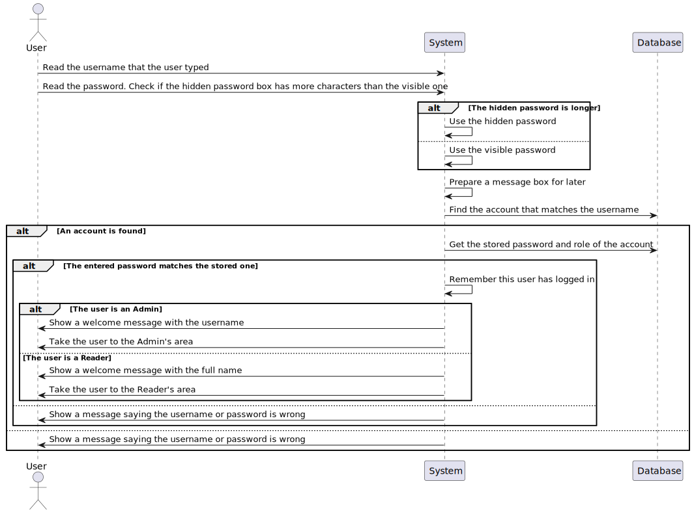
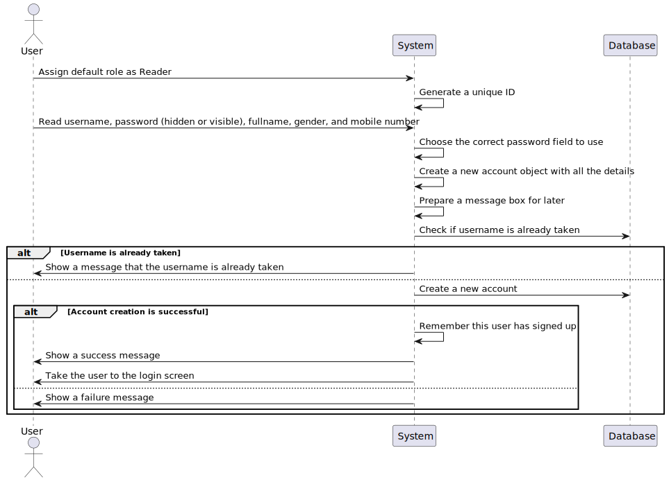
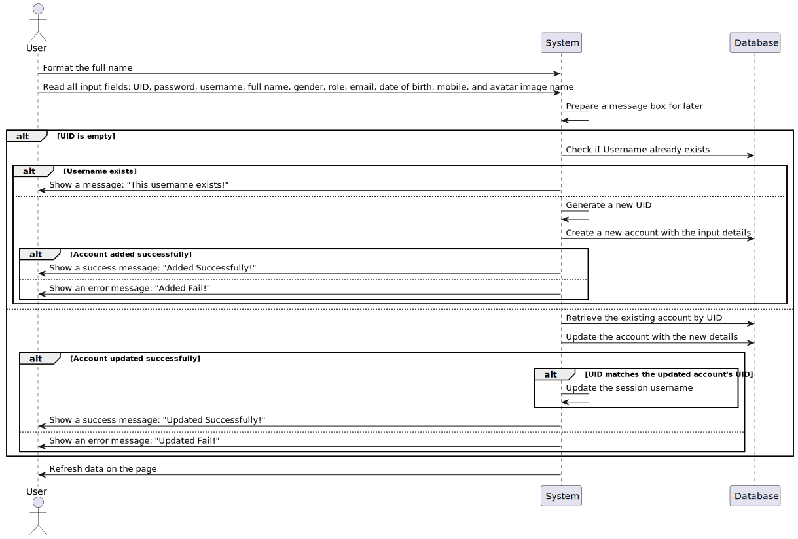
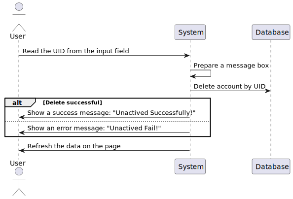
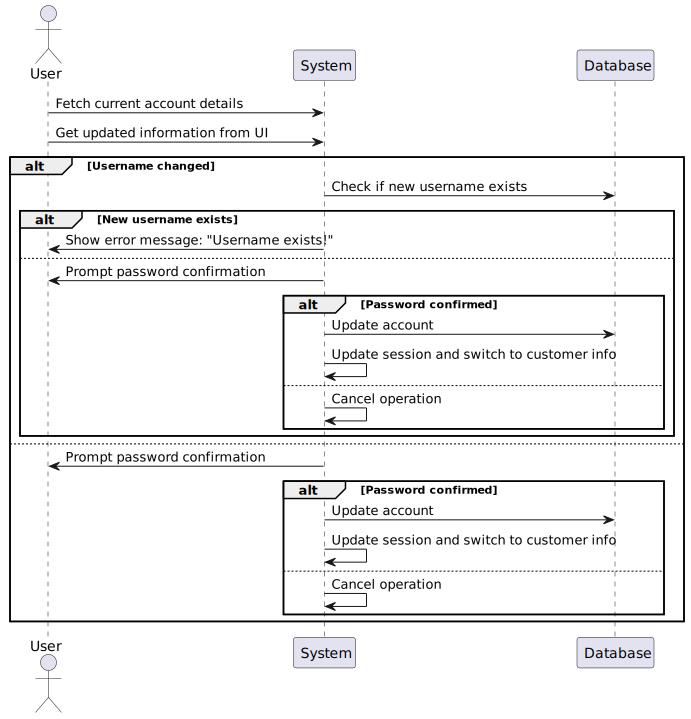
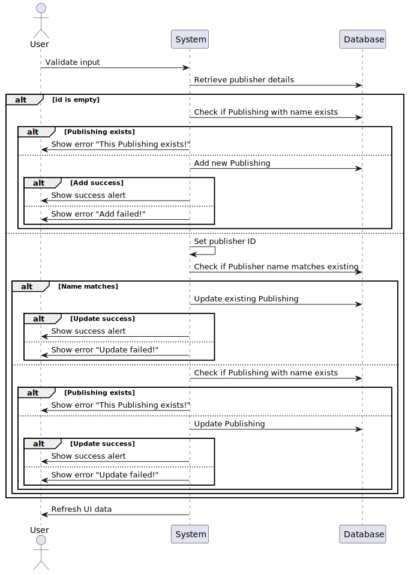
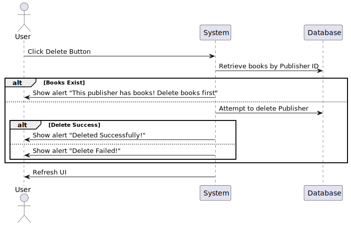
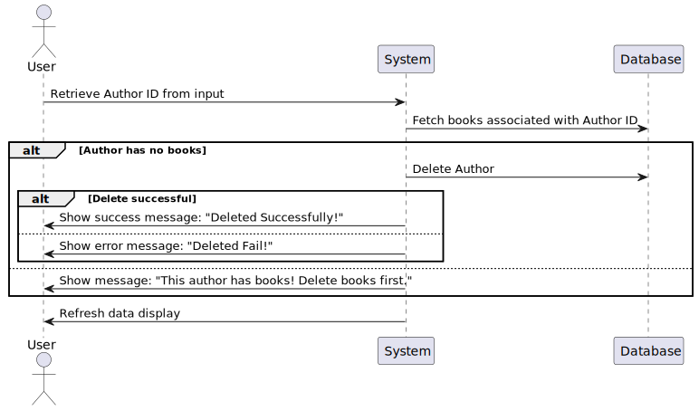
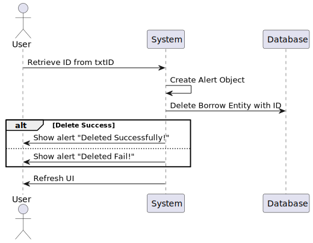

# Library-management-system

## Set up

### In Intellij:

- Download javafx sdk: https://gluonhq.com/products/javafx/ then un archive
- Import javafx sdk: \
  File →
  Project Structure → Libraries → click on `+` symbol
  (New project libraries) → choose pathToSdk/lib → click `Ok`
- Set up sdk: \
  File →
  Project Structure → SDKs (under platform settings) → choose jdk17
- Edit configurations: \
    - Add Vm options: --module-path pathToSdk/lib --add-modules javafx.controls,javafx.fxml \
    - Note: pathToSdk should be an absolute path. (e.g.
      /Users/viettran/Public/project/apptech_graduated/project2/library-management-system/externallib/javafx-sdk-17.0.13.2)
- Run

## Admin account

username: admin
password: password123

## Entity Relationship Diagrams

## DB Diagram

### Description

| Table Name    | Column Name    | Data Type     | Constraints | Description                                                    |
|---------------|----------------|---------------|-------------|----------------------------------------------------------------|
| roles         | id             | BIGSERIAL     | PRIMARY KEY | Unique identifier for each role.                               |
|               | name           | VARCHAR(64)   |             | Name of the role.                                              |
| accounts      | id             | BIGSERIAL     | PRIMARY KEY | Unique identifier for each account.                            |
|               | UID            | VARCHAR(36)   |             | Unique user identifier.                                        |
|               | avatar         | VARCHAR(1000) |             | URL of the account avatar image.                               |
|               | username       | VARCHAR(64)   |             | Username of the account holder.                                |
|               | password       | VARCHAR(64)   |             | Password of the account holder.                                |
|               | full_name      | VARCHAR(64)   |             | Full name of the account holder.                               |
|               | gender         | INT           |             | Gender of the account holder (0 for female, 1 for male, etc.). |
|               | email          | VARCHAR(50)   |             | Email address of the account holder.                           |
|               | dob            | DATE          |             | Date of birth of the account holder.                           |
|               | mobile         | VARCHAR(11)   |             | Mobile number of the account holder.                           |
|               | status         | INT           |             | Status of the account (active, suspended, etc.).               |
|               | roleId         | INT           | FOREIGN KEY | Role ID assigned to the account, references `roles(id)`.       |
|               | createdAt      | DATE          |             | Date when the account was created.                             |
|               | updatedAt      | DATE          |             | Date when the account was last updated.                        |
| categories    | id             | BIGSERIAL     | PRIMARY KEY | Unique identifier for each category.                           |
|               | name           | VARCHAR(50)   |             | Name of the category.                                          |
|               | createdAt      | DATE          |             | Date when the category was created.                            |
|               | updatedAt      | DATE          |             | Date when the category was last updated.                       |
| authors       | id             | BIGSERIAL     | PRIMARY KEY | Unique identifier for each author.                             |
|               | name           | VARCHAR(50)   |             | Name of the author.                                            |
|               | dob            | DATE          |             | Date of birth of the author.                                   |
|               | sign_name      | VARCHAR(64)   |             | Pseudonym or pen name of the author.                           |
|               | createdAt      | DATE          |             | Date when the author was added.                                |
|               | updatedAt      | DATE          |             | Date when the author's information was last updated.           |
| publishing    | id             | BIGSERIAL     | PRIMARY KEY | Unique identifier for each publisher.                          |
|               | name           | VARCHAR(100)  |             | Name of the publisher.                                         |
|               | address        | VARCHAR(150)  |             | Address of the publisher.                                      |
|               | co_year        | DATE          |             | Year when the publisher was established.                       |
|               | createdAt      | DATE          |             | Date when the publisher was added.                             |
|               | updatedAt      | DATE          |             | Date when the publisher's information was last updated.        |
| books         | id             | BIGSERIAL     | PRIMARY KEY | Unique identifier for each book.                               |
|               | name           | VARCHAR(100)  |             | Title of the book.                                             |
|               | image          | VARCHAR(1000) |             | URL of the book's cover image.                                 |
|               | co_year        | DATE          |             | Year of publication.                                           |
|               | price          | FLOAT         |             | Price of the book.                                             |
|               | quantity       | INT           |             | Number of available copies of the book.                        |
|               | description    | VARCHAR(1000) |             | Description or synopsis of the book.                           |
|               | categoryId     | INT           | FOREIGN KEY | Category ID, references `categories(id)`.                      |
|               | authorId       | INT           | FOREIGN KEY | Author ID, references `authors(id)`.                           |
|               | publishId      | INT           | FOREIGN KEY | Publisher ID, references `publishing(id)`.                     |
| status_manage | id             | BIGSERIAL     | PRIMARY KEY | Unique identifier for each book status in management.          |
|               | name           | VARCHAR(64)   |             | Name of the status (e.g., available, on hold).                 |
| status_borrow | id             | BIGSERIAL     | PRIMARY KEY | Unique identifier for each borrow status.                      |
|               | name           | VARCHAR(64)   |             | Name of the borrow status (e.g., returned, overdue).           |
| manage_book   | id             | BIGSERIAL     | PRIMARY KEY | Unique identifier for each book management record.             |
|               | price_per_book | FLOAT         |             | Price per book for the management.                             |
|               | accountId      | INT           | FOREIGN KEY | Account ID, references `accounts(id)`.                         |
|               | bookId         | INT           | FOREIGN KEY | Book ID, references `books(id)`.                               |
|               | statusId       | INT           | FOREIGN KEY | Status ID, references `status_manage(id)`.                     |
|               | createdAt      | DATE          |             | Date when the book was added to management.                    |
|               | updatedAt      | DATE          |             | Date when the book's management record was last updated.       |
| borrow        | id             | BIGSERIAL     | PRIMARY KEY | Unique identifier for each borrowing record.                   |
|               | borrowAt       | DATE          |             | Date when the book was borrowed.                               |
|               | refundAt       | DATE          |             | Date when the book was refunded.                               |
|               | amount_of_pay  | FLOAT         |             | Payment amount for borrowing the book.                         |
|               | manageId       | INT           | FOREIGN KEY | Management ID, references `manage_book(id)`.                   |
|               | statusId       | INT           | FOREIGN KEY | Status ID, references `status_borrow(id)`.                     |
|               | accountId      | INT           | FOREIGN KEY | Account ID, references `accounts(id)`.                         |

## Dataflow

### Login

### SignUp

### Create or Update Account

### Delete Account

### Edit customer info

### Save books

### Delete book

### Save publisher

### delete publisher

### save category

### delete category

### save author

### delete author

### save borrowing

### delete borrowing
